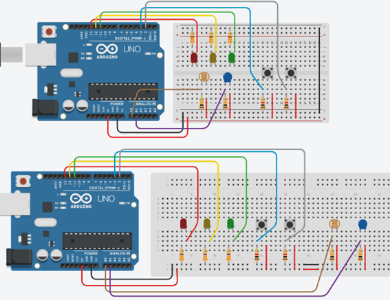

# Workshop ComFAPOO (Computação Física para Aprendizagem de Programação Orientada a Objetos)

Workshop idealizado utilizando o [método ComFAPOO](https://liag.ft.unicamp.br/computacaofisica/projetocfac/), criado por pesquisadores do [Laboratório de Informática, Aprendizagem e Gestão (LIAG)](https://liag.ft.unicamp.br/) da [Faculdade de Tecnologia (FT)](https://www.ft.unicamp.br/) da Universidade Estadual de Campinas (UNICAMP).

## Objetivo do método
Ensinar conceitos fundamentais de Programação Orientada a Objetos (POO) promovendo uma aprendizagem significativa através do uso de componentes físicos programáveis, auxiliando no processo abstração de conceitos complexos por meio de objetos concretos.

### Algumas publicações sobre o método:
+ ZANETTI, H. A. P.; BORGES, M. A. F.. Por que estimular a Aprendizagem Significativa no ensino de Programação Orientada a Objetos?. In: Anais do Simpósio Brasileiro de Educação em Computação. SBC, 2021. p. 290-295. Disponível [aqui](https://sol.sbc.org.br/index.php/educomp/article/view/14496).
+ ZANETTI, H. A. P.; BORGES, M. A. F. ; RICARTE, I. L. M.. Método de ensino de programação Orientada a Objetos baseado em Computação Física, Aprendizagem Significativa e Concreteness Fading. In A. J. Osório, M. J. Gomes, A. Ramos, & A. L. Valente (Eds.), Challenges 2021, desafios do digital: Livro de atas (1.ª ed., pp. 23-32). Universidade do Minho. Centro de Competência. Disponível [aqui](https://www.nonio.uminho.pt/challenges/publicacoes/) (baixar “Livro de Atas”).

---
# Questionário para ser respondido antes do Workshop
 [Link para o questionário](https://docs.google.com/forms/d/1c6jm_Vc3Fqxj_aAxPmDpB9W-69xcYer8_sJY5aPtXQU) 
 
---

# Montagem para as práticas
  
 
---

# Etapas do workshop

## Parte 1 - [Classe e Objeto](/workshop_parte1.md) 
## Parte 2 - [Encapsulamento](/workshop_parte2.md) 
## Parte 3 - [Herança](/workshop_parte3.md) 
## Parte 4 - [Polimorfismo](/workshop_parte4.md) 
## Parte 5 - [Sistema orientado a objetos](/workshop_parte5.md) 
