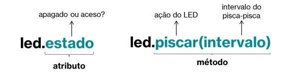

# WORKSHOP PARTE 1
## Classe e Objeto

---
### Objetivos da prática

- Entender o conceito de __classe__ como uma identidade que descreve um componente real, o __objeto__.
- Descrever os principais componentes (propriedades e ações) do componente eletrônico, apresentando os conceitos de __atributos__ e __métodos__.
- Mostrar a relação entre a classe e o objeto (__instanciação__ e uso de método __construtor__).

---
### Circuitos

#### Tarefa 1

__Circuito da Tarefa 1__

##### Lista de componentes para montagem
- 1 LED vermelho
- 1 resistor de 330 ohms
- 3 cabos de conexão

#### Tarefa 2

__Circuito da Tarefa 2__

##### Lista de componentes para montagem
- 2 LEDs (1 vermelho e 1 verde)
- 2 resistores de 330 ohms
- 4 cabos de conexão

#### Tarefa 3

__Circuito da Tarefa 2__

##### Lista de componentes para montagem
- 1 LED vermelho
- 1 resistor de 330 ohms
- 1 buzzer
- 6 cabos de conexão

___

### Conhecendo os objetos

#### Objeto LED


__Características e ações do LED__

#### Objeto Buzzer


__Características e ações do do buzzer__

___

### Representando os objetos Classes

#### Classe LED


__Características e ações do LED__

#### Classe Buzzer


__Características e ações do LED__


### Representando em código-fonte

Para essa tarefa, vamos "traduzir" nosso classe LEd em código-fonte, criando todas suas características (__atributos__) e ações (__métodos__)

```
class Led{
  int pino;
  int estado;
  
  void configurar(){
    pinMode(this->pino, OUTPUT);
    digitalWrite(this->pino, this->estado);
  }
  
  void acender(){
    digitalWrite(this->pino, HIGH);
  }
  
  void apagar(){
    digitalWrite(this->pino, LOW);
  }
  
  void piscar(int intervalo){
    acender();
    delay(intervalo);
    apagar();
    delay(intervalo);
  }
};
```

Por enquanto, não iremos discutir o modo de acesso __`public`__ presente no código (será alvo da Parte 2!).
Usando a declaração __`this`__ para diferenciar nossos __atributos__ das variáveis que são utilizadas dentro de nossos métodos.
Uma classe descreve um objeto, mas para criar esse objeto, e essa criação chamamos de __instância__. Para criar ou "construir" esse objeto precisamos de uma outro um outro método, um método especial denominado __construtor__.
Para construir um objeto LED temos que pensar o que seria interessante definir as características (__atributos__) principais do objeto __real__ LED: quanl é o pino em que ele está conectado e qual seu estado inicial.
Esse método construto, por regra da própria linguagem, deve ter o __nome da classe__ e recerbos os parâmetros iniciais da sua criação. 

Vamos agora criar e usar o objeto LED, que está concetado ao pino __13__ e começara apagado.Também aproveitamos para usar o método __`acender()`__, para fazê-lo acender.
````
Led led = Led(13,LOW);

void setup() {
  led.configurar();
}

void loop() {
 led.acender();
}

````

Depois podemos fazer o tradicional "Hello World!" do Arduino: fazer uma LED piscar, com o intervalo de 1 segundo (1000 ms)

```
void loop() {
  led.acender();
  delay(1000);
  led.apagar();
  delay(1000);
}
```

Ou até mesmo, podemos usar o método __`piscar()`__, passando o intervalo desejado para o pisca-pisca.
```
void loop() {
  led.piscar();
}
```
