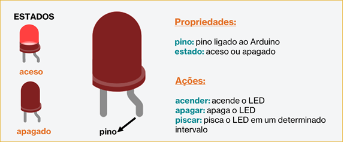
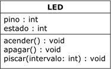
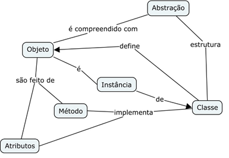

# WORKSHOP PARTE 1
## Classe e Objeto

---
### Objetivos da prática

- Entender o conceito de __classe__ como uma identidade que descreve um componente real, o __objeto__.
- Descrever os principais componentes (propriedades e ações) do componente eletrônico, apresentando os conceitos de __atributos__ e __métodos__.
- Mostrar a relação entre a classe e o objeto (__instanciação__ e uso de método __construtor__).
- Fazer o exerecício de __abstração__, ou seja, entender a __identidade__ do objeto (sua função no sistema geral), suas __propriedades__  e suas __ações__.

---
### Tarefa 1 - Conhecendo o objeto LED

Nessa tarefa vamos conhecer o objeto LED __real__, entender quais são suas principais __propriedades__ e __ações__ através da demonstrações e alguns diagramas.

#### Circuito para a tarefa


##### Lista de componentes para montagem
- 1 LED vermelho
- 1 resistor de 330 ohms
- 3 cabos de conexão

#### Objeto LED




#### Classe LED




### Representando em código-fonte

Para essa tarefa, vamos "traduzir" nosso classe LEd em código-fonte, criando todas suas características (__atributos__) e ações (__métodos__)

```
class Led{
  int pino;
  int estado;
  
  public:  
  void acender(){
    digitalWrite(this->pino, HIGH);
  }
  
  void apagar(){
    digitalWrite(this->pino, LOW);
  }
  
  void piscar(int intervalo){
    acender();
    delay(intervalo);
    apagar();
    delay(intervalo);
  }
};
```

Por enquanto, não iremos discutir o modo de acesso __`public`__ presente no código (será alvo da Parte 2!).
Usando a declaração __`this`__ para diferenciar nossos __atributos__ das variáveis que são utilizadas dentro de nossos métodos.
Uma classe descreve um objeto, mas para criar esse objeto, e essa criação chamamos de __instância__. 
Para criar ou "construir" esse objeto precisamos de uma outro um outro método, um método especial denominado __construtor__.
Para construir um objeto LED temos que pensar o que seria interessante definir as características (__atributos__) principais do objeto __real__ LED: qual é o pino em que ele está conectado?
Esse método construtor, por regra da própria linguagem, deve ter o __nome da classe__ e receber os parâmetros iniciais da sua criação (no caso, o pino o qual está conectado). 
```
class Led{
  int pino;
  int estado;
  
  public:
  Led(int pino){
    this->pino = pino;
    pinMode(this->pino, OUTPUT);
  }
  void acender(){
    digitalWrite(this->pino, HIGH);
  }
  void apagar(){
    digitalWrite(this->pino, LOW);
  }
  void piscar(int intervalo){
    acender();
    delay(intervalo);
    apagar();
    delay(intervalo);
  }
};
```


Vamos agora criar e usar o objeto LED, que está concetado ao pino __13__ e começara apagado.Também aproveitamos para usar o método __`acender()`__, para fazê-lo acender. Ainda nnão usaremos a função obrigatória __`setup()`__ do Arduino, apenas a __`loop()`__ a qual se localiza nossa lógica e o ciclo de repetição constante. Nossa configuração inicial do LED está inserido em nosso método construtor.
````
Led led = Led(13);

void setup() {
}

void loop() {
 led.acender();
}

````

Depois podemos fazer o tradicional "Hello World!" do Arduino: fazer uma LED piscar, com o intervalo de 1 segundo (1000 ms)

```
void loop() {
  led.acender();
  delay(1000);
  led.apagar();
  delay(1000);
}
```

Ou até mesmo, podemos usar o método __`piscar()`__, passando o intervalo desejado para o pisca-pisca.
```
void loop() {
  led.piscar(1000);
}
```

___


### Tarefa 2

Para essa tarefa, vamos ver uma das maiores vantagens da Programação Orientada a Objetos, que é o reuso de código da classe para criar mais de um objeto.
Vamos adicionar mais um LED (verde) e vamos criar uma objeto utilizando a classe existente. Vamos fazer uma pisca-pisca alternando entre os 2 LEDs.
O LED vermelho continua no pino 13 e irá iniciar aceso, enauqnto o LED verde está concectado ao pino 7 e se iniciará apagado, e depois alternamos entre eles.


__Circuito da Tarefa 2__

##### Lista de componentes para montagem
- 2 LEDs (1 vermelho e 1 verde)
- 2 resistores de 330 ohms
- 4 cabos de conexão

### Código-fonte

```
Led ledVermelho = Led(13);
Led ledVerde = Led(7);

void setup() {
}

void loop() 
{
  ledVermelho.acender();
  ledVerde.apagar();
  delay(1000);
  ledVermelho.apagar();
  ledVerde.acender();
  delay(1000);
}

```

---
### Discussões sobre a prática

Nas práticas vimos desde o conceito de Abstração de um objeto até a criação e utilização do mesmo. A apresentação do objeto "real" nos ajuda a identificar o "objeto" a ser programado em linhas de código representará o objeto real LED. Essas relações podemos ver no mapa conceital abaixo.



