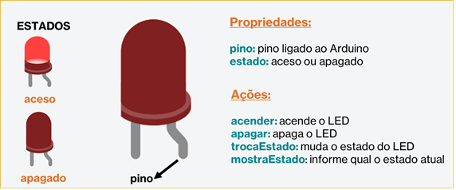
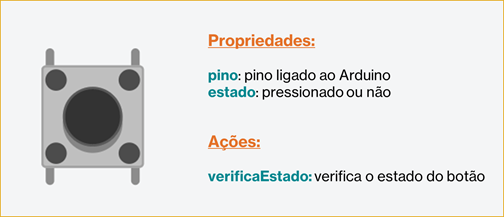

# WORKSHOP PARTE 2
## Encapsulamento

---
### Objetivos da prática

- Entender melhor o conceito de __encapsulamento__.
- Compreender os modificadores __público__ e __privado__.
- Aprender sobre os __tipos de acesso_ à atributos e métodos dos objetos.

---
### Tarefa 1 - Melhorando nossa classe LED

Nesta tarefa vamos melhorar a nossa classe LED usando o conceito de Encapsulamento. Esse conceito corresponde a __“esconder”__ o que é essencial do objeto, permitindo que outros objetos interajam através de __“interfaces”__ (através de métodos). Simplificando: os objetos possuem internamente os dados que podem sofrer alterações (no caso do LED, o estado seria um exemplo) mas não devem ser acessados por outros objetos ou demais trechos de código. Quem tem que definir essa alteração é o próprio objeto, é a __responsabilidade__ dele!
Através de métodos podemos dar acesso a alterações ou verificar os estados desses dados. Nesse momento vamos criar uma nova classe LED, com os métodos `acender()` e `apagar()`, mas acrescentando mais 2:
- __`trocaEstado`__: esse método será o acesso para que seja trocado o estado do LED, de aceso para pagado, ou vice-versa.
- __`mostraEstado`__: esse método irá mostrar qual é o estado do LED (aceso ou apagado)


#### Circuito para a tarefa


##### Lista de componentes para montagem
- 1 LED vermelho
- 1 resistor de 330 ohms
- 3 cabos de conexão

#### Objeto LED



#### Acesso aos atributos e métodos

Precisamos definir o que será "encapsulado", "escondido" e o que será acessível:
- __Escondido__:
	- os atributos pino e estado, pois só podem ser alterados pelo próprio objeto
	- os métodos `acender()` e `apagar()`, pois agora eles irão alterar o atributo `estado`
- __Acessível__:
	- o método construtor, para que se possa criar o objeto
	- os métodos `trocaEstado()` e `mostraEstado()`, que serão como vamos pedir para mudar o estado do LED e como vemos se seu estado mudou
Com isso, podemos definir seus modos de acessos. O que será escondido será demarcado como __privado__ (_private_) e o que será acessível será demarcado como __público__ (_public_).

#### Classe LED
Nosso novo diagrama da __Classe LED__, com as marcações privado (-) e público (+).


### Representando em código-fonte

Para essa nova classe, nosso método construtor também iremos indicar qual é o nosso estado inicial do LED.

```
class Led{
  int pino;
  int estado;
  
  public:
  Led(int pino, int estado){
    this->pino = pino;
    this->estado = estado;
    pinMode(this->pino, OUTPUT);
    digitalWrite(this->pino, this->estado);
  }
  
  void trocaEstado(){
    if(this->estado == LOW)
      	acender();
    else
        apagar();
  }
  
  int mostraEstado(){
    return this->estado;
  }
  
  private:
  void acender(){
    digitalWrite(this->pino, HIGH);
    this->estado = HIGH;
  }
  
  void apagar(){
    digitalWrite(this->pino, LOW);
    this->estado = LOW;
  }
  
};
```

Podemos notar que os atributos são por padrão definidos como __privado__ (_private_), mas os métodos precisam da demarcação __private:__. A partir da demarcação __public:__ podemos ver nossos métodos __públicos__ (__public__). Chamaos esses cocneitos de acesso de __visibilidade__.
Para comprovar que não acessamos o que é privado, vamos tentar criar um objeto LED apagado e tentar acender através do acesso direto ao método acender().

```
Led led = Led(13,LOW);

void setup()
{
}

void loop()
{
  led.acender();
}
```

Esse trecho de código trará um __erro de acesso__.

Vamos agora fazer um pisca-pisca usando o método `trocaEstado()` e mostrar no __"monitor Serial"__ (interface para mostrar mensagem do Arduino) o estado do LED, com o método `mostraEstado()`. 

```
Led led = Led(13,LOW);

void setup()
{
  Serial.begin(9600);
}

void loop()
{
  led.trocaEstado();
  delay(1000);
  Serial.print("Estado do LED: ");
  Serial.println(led.mostraEstado());
}
```

___


### Tarefa 2 - Interação com botão

O encapsulamento tem uma grande vantagem que delegar as responsabilidades de cada objeto, deixando o sistema mais modular e independente dos demais objetos (desacoplamento). Para que outro objeto possa interagir com outro, apenas usaremos esses métodos "interfaces", ou seja, que provêm acesso a informações e dados.
Nessa tarefa, usando nossa classe LED, vamos construir um sistema onde temos um botão (_push button_) que aciona o acender ou apagar de um LED, através de um método que verifica se o botão está ou não pressionado (`verificaEstado()`). Como nosso LED pode iniciar aceso ou apagado, pois este não tem acesso aos métodos `acender()` e `apagar()`. Nesse cenário, o LED tem a responsabilidade de verificar seu estado e decidir se acende ou apaga, enquanto o botão apenas de verificar se houve ou não o pressionar do botão.


### Circuito da Tarefa


##### Lista de componentes para montagem
- 1 LED 
- 1 resistor de 330 ohms
- 1 resistor de 1 kohms
- 1 push button
- 5 cabos de conexão

### Objeto Botão


### Classe Botão


### Código-fonte
Abaixo temos a representação em código da classe Botão.

```
class Botao{
  int pinoBotao;
  int estado;
  
  public:
  Botao(int pino){
  	pinoBotao = pino;
    pinMode(pinoBotao, INPUT);
  } 
  
  int verificaEstado(){
    estado = digitalRead(pinoBotao);
    delay(10);
    return estado;
  }
  
};
```


E depois, podemos utilizar os objetos LED e Botão para fazer uma interação de acender e apagar.

```
Led led = Led(13,LOW);
Botao botao = Botao(2);


void setup() {
  Serial.begin(9600);
}

void loop() {
 int est;
 est = botao.verificaEstado();
 if (est == HIGH){
    led.trocaEstado();
 }
 Serial.print("Estado do LED: ");
 Serial.println(led.mostraEstado());
 delay(100);
}
```
---
#### Parte 3 - [Herança](/workshop_parte3.md)
