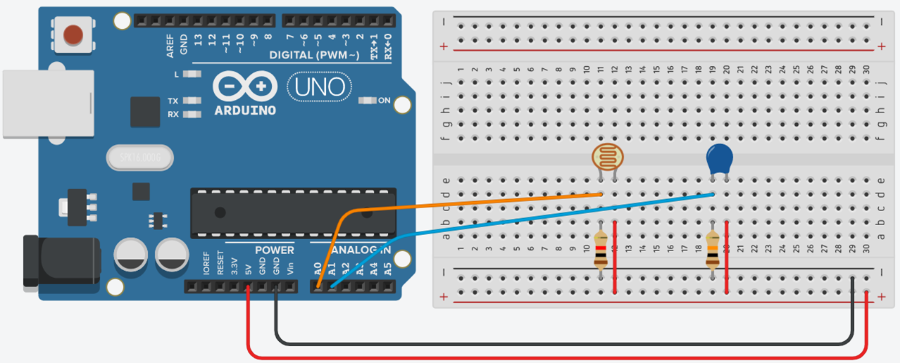
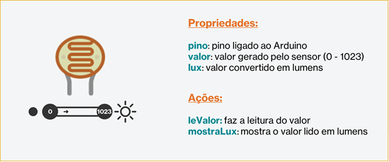
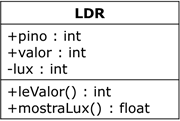
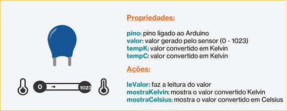
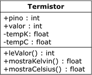
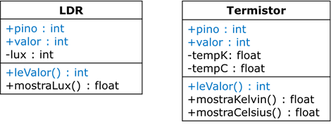
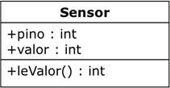
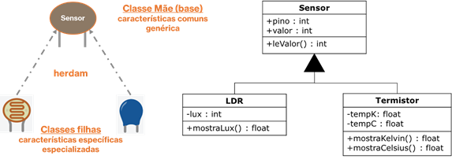

# WORKSHOP PARTE 3
## Herança

---
### Objetivos da prática

- Entender o conceito de __herança.__
- Entender a aplicação de __reuso__ de código


---
### Tarefa 1 - Entendendo como funciona um sensor de luminosidade

Nesta tarefa vamos definir quais são as características principais de um sensor. Sensores são dispositivos que percebem alterações ambientes, e como resultado, nos fornece um valor correspondente ao fenômeno ambiental o qual ele está __“sentindo”__.
Por exemplo, um sensor de luminosidade, como o __LDR__ (_Light Dependent Resistor_), nos fornecerá um valor que varia conforme a incidência de luz sobre ele. Em Arduino, esse valor pode variar de um intervalo de __0 a 1023__. Esse valor refere-se desde a __ausência de luz__ (__0__) até a __maior concentração de luz__ que o sensor consegue captar (__1023__).
Esse valor não é nenhuma medida em específico, mas sim um valor que representa a variação de resistência do sistema. Para que esse valor seja uma medida de luz (lumens ou lux), temos que fazer uma conversão.


#### Circuito para a tarefa



##### Lista de componentes para montagem
- 1 LDR
- 1 termistor
- 1 resistor de 1 kohms
- 1 resistor de 10 koms
- 6 cabos de conexão

#### Objeto LDR



#### Classe LED



### Representando em código-fonte

```
class LDR{
  int lux;
  int valor;
  int pino;

  public:
  LDR(int pino){
    this->pino = pino;
  }

  int leValor(){
    this->valor = analogRead(this->pino);
    return this->valor;
  }

  float mostraLux (){
    float voltagem = leValor()*0.0048828125;
    this-> lux = 500 /(10*((5 - voltagem)/voltagem));
    return this->lux;
  }
  
};

```


#### Objeto Termistor



#### Classe Termistor




### Representando em código-fonte

```
class Termistor{
  int valor;
  int pino;
  float tempK;
  float tempC;
   
  public:
  Termistor(int pino){
    this->pino = pino;
  }
   
  int leValor(){
    this->valor = analogRead(this->pino);
    return this->valor;
  }
  
  float mostraKelvin(){
   this->tempK = log(10000.0 * (1024.0 / leValor() - 1));
   this->tempK = 1 / (0.001129148 + (0.000234125 +  (0.0000000876741 * this->tempK * this->tempK)) * this->tempK);
   return this->tempK;
  }
 
  float mostraCelsius() {
   this->tempC = mostraKelvin() - 273.15; 
   return this->tempC;
  }
};

```

Podemo fazer um teste rápido com essas classes.

```
Termistor termistor = Termistor(A1);
LDR ldr = LDR(A0);

void setup(){
  Serial.begin(9600);
}

void loop(){
  Serial.print("Temperatura em Celsius: ");
  Serial.println(termistor.mostraCelsius());
  Serial.print("Temperatura em Kelvin: ");
  Serial.println(termistor.mostraKelvin());
  Serial.print("Luminosidade em lux: ");
  Serial.println(ldr.mostraLux());
  delay(1000);
}
```

#### Similaridades entre os objetos
É possível perceber que ambos os objetos compartilham __características semelhantes__, tanto nos __atributos quanto nos métodos__. Inclusive, se repararmos, até __suas montagens na protoboard são semelhantes!__ Quando temos classes com esse comportamento, podemos utilizar o conceito de __herança__.
Podemos perceber que há similaridades entre os sensores. Isso é comum entre componentes sensores, e podemos otimizar nosso código nos utilizando dessas características similares. Quando temos objetos que possuem atributos e métodos similares, podemos criar uma classe que tenha essas similaridades e, a partir dela, criar __classes mais especialistas__.
___


### Tarefa 2 - Separando as características e usando herança

A herança é um recurso que permite que as características comuns a mais de uma classe podem ser colocadas em uma classe base. Também podemos chamar de uma classe __"mãe"__ e suas classes __"filhas"__, reforçando o conceito de herança. Cada classe derivada ou subclasse terá toda a estrutura da classe base e mais os novos recursos que eles precisam suas funções particulares.
As classes LDR e Termistor tem várias características similares, como vemos abaixo:



#### Superclasse Sensor
Nesse caso, podemos criar uma classe __Sensor__, que possui __todas as características em comuns__, e criar classes complementares, que só possua as especialidades (atributos e métodos especializados). Com isso, podemos definir que as classes LDR e Termistor poderiam ser essas classes especializadas.
A partir dessas semelhanças, podemos criar uma __classe base++, com essas características comuns. Essa classe "Sensor' genérico, como vemos abaixo:



Com isso, as classes LDR e Termistor podem herdar dessa classe Sensor essas __características comuns a elas__, e definindo apenas suas especialidades. Essa organização com as novas classes seria:




### Representando em código-fonte a classe Sensor

```
class Sensor{
  public:
  int valor;
  int pino;
  
  public:
   int leValor(){
    this->valor = analogRead(this->pino);
    return this->valor;
  }
};

```


### Representando em código-fonte a classe LDR

```
class LDR: public Sensor{
  int lux;
  
  public:
  LDR(int pino){
    this->pino = pino;
  }
  
  float mostraLux (){
    float voltagem = leValor()*0.0048828125;
    this-> lux = 500 /(10*((5 - voltagem)/voltagem));
    return this->lux;
  }
  
};
```

### Representando em código-fonte a classe Termistor

```
class Termistor: public Sensor{
  float tempK;
  float tempC;
   
  public:
  Termistor(int pino){
    this->pino = pino;
  }
  float mostraKelvin(){
   this->tempK = log(10000.0 * (1024.0 / leValor() - 1));
   this->tempK = 1 / (0.001129148 + (0.000234125 + (0.0000000876741 * this->tempK * this->tempK)) * this->tempK);
   return this->tempK;
  }
 
  float mostraCelsius() {
   this->tempC = this->tempK - 273.15; 
   return this->tempC;
  }
};

```

Na construção da classe Sensor, vemos que __não há um construtor__, pois não há necessidade, já que vamos utilizar as classes mais especializadas (as derivadas). Também notamos que na definição na classe, logo a frente de seu nome, utilizamos __:__ (_dois pontos_), que indica de quem a classe irá herdar as características, como vemos em:

`class LDR: public Sensor{`

Agora, podemos testar a criação e uso dessas classes derivadas usando o mecanismo de herança.

```
LDR ldr = LDR(A0);
Termistor termistor = Termistor(A1);

void setup(){
  Serial.begin(9600);
}

void loop(){
  Serial.print("Valor do LDR: ");
  Serial.println(ldr.leValor());
  Serial.print("Lux: ");
  Serial.println(ldr.mostraLux());
  Serial.print("Valor do Termistor: ");
  Serial.println(termistor.leValor());
  Serial.print("Kelvin: ");
  Serial.println(termistor.mostraKelvin());
  Serial.print("Celsius: ");
  Serial.println(termistor.mostraCelsius());
  delay(1000);
}

```
---
#### Parte 4 - [Polimorfismo](/workshop_parte4.md)
