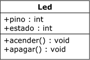
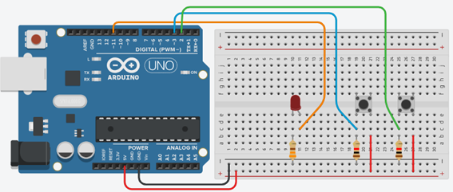

# WORKSHOP PARTE 4
## Polimorfismo

---
### Objetivos da prática

- Entender o conceito de __polimorfismo.__
- Aplicar o polimorfismo em um contexto prático.


---
### Tarefa 1 - Revendo o conceito de LED

Nessa tarefa vamos ver como podemos programar e utilizar objetos que podem se comportar de formas diferentes. O conceito de __Polimorfismo__ (_poli_ = muitas, _morfo_ = forma). Essa é umas das características mais poderosas da Programação Orientada a Objetos, pois podemos através de um mesmo objeto usar seus métodos de formas diferentes, dependendo do contexto.
Para isso, vamos voltar a usar o conceito de __classe base__ (visto em Herança). No Polimorfismo, duas ou mais classes derivadas de uma superclasse podem usar métodos de __mesma assinatura__ (_mesmo nome e parâmetros_), mas que podem se comportar de __maneiras diferentes__ ou __formas diferentes__.


#### Circuito para a tarefa


##### Lista de componentes para montagem
- 1 LED
- 1 resistor de 330 ohms
- 3 cabos de conexão


#### Objeto LDR
Para essa tarefa, vamos utilizar um objeto LED mais simples.


#### Classe LED



### Representando em código-fonte

```
class Led{
  public:
  int pino;
  int estado;
  
  public:
  Led(int pino){
    this->pino = pino;
    pinMode(this->pino, OUTPUT);
  }
  
  void acender(){
    digitalWrite(this->pino,HIGH);
  }
  
  void apagar(){
    digitalWrite(this->pino,LOW);
  }
};
```

A partir dessa classe LED simples, que possui o método `acender()` como a ação de acender totalmente o LED, vamos imaginar que ele não poderia ser aplicada diretamente para uma aplicação de pisca-pisca ou de um sinal oscilante (com a iluminação aumentando gradativamente), comum em sistema de sinalização de emergência.

Com isso, vamos implementar __2 formas novas__ de acender o LED: __piscando__ e __oscilando__.


### Tarefa 2 - Criando uma classe base e suas novas formas

Nesta tarefa, vamos criar 2 novas formas de acender um LED

#### Circuito para a tarefa


##### Lista de componentes para montagem
- 1 LED
- 2 push button
- 1 resistor de 330 ohms
- 2 resistores 2 kohms
- 8 cabos de conexão

Para criar nossa classe base, devemos sinalizar qual ou quais métodos terão comportamentos diferentes. Esse método será um __método virtual__, ou seja, na verdade será uma regra na classe base e terá sua implementação, um diferente da outra, nas classes derivadas. Como não usaremos essa classe para um objeto, ela não terá um construtor.
Para isso, colocamos o termo __virtual__ antes da definição do método. Com isso, esse método poderá ser __sobrescrito nas classes derivadas__, ou seja, poderá assumir __formas diferentes__ de implementação. 

### Representando em código-fonte 

```
class Led{
  public:
  int pino;
  int estado;
  
  public:
  virtual void acender(){
	digitalWrite(this->pino,HIGH);
  }
  
  void apagar(){
    digitalWrite(this->pino,LOW);
  }
};

```

Vemos que o método __`acender()`__ se mantém igual, apenas com precedência do termo __`virtual`__, indicando que esse pode ser um método que poderá ser sobrescrita nas classes derivadas. __Se a classe derivada não sobrescrever o método, prevalecerá o que está definido na classe base__.
O método __`apagar()`__ e os atributos serão herdados integralmente e sem mudança pelas subclasses.
Vamos criar 2 classes derivadas para redefinir o método `acender()` em cada uma delas. Em uma teremos os métodos acender de __forma piscante__, na outra de __forma oscilante__.


#### Classe LED base e suas derivadas


### Representando em código-fonte (classe LedOscila)

```
class LedOscila: public Led{
  
  public:
  LedOscila(int pino){
    this->pino = pino;
    pinMode(this->pino, OUTPUT);
  }
  
  void acender(){
    int lum;
    for(lum = 0; lum < 255; lum += 5){
      analogWrite(this->pino, lum);
      delay(50);
    }
    lum = 0;
    this->apagar();
  }
};

```

### Representando em código-fonte (classe LedPisca)

```
class LedPisca: public Led{
  public:
  LedPisca(int pino){
    this->pino = pino;
    pinMode(this->pino, OUTPUT);
  }
  
 void acender(){
    digitalWrite(this->pino,HIGH);
    delay(100);
    digitalWrite(this->pino,LOW);
    delay(100);
  }
};

```

Vamos agora adicionar a classe Botão, já conhecida por nós, para fazermos alguns testes.

```
class Botao{
  int pinoBotao;
  int estado;
  
  public:
  Botao(int pino){
    pinoBotao = pino;
    pinMode(pinoBotao, INPUT);
  } 
  
  int verificaEstado(){
    estado = digitalRead(pinoBotao);
    delay(10);
    return estado;
  }
  
};

Led *led;
Botao botao1 = Botao(2);
Botao botao2 = Botao(3);

void setup()
{
 Serial.begin(9600);
}

void loop()
{
  if(botao1.verificaEstado() == HIGH){
    led = &LedPisca(11);
    led->acender();
  }else if(botao2.verificaEstado() == HIGH){
    led = &LedOscila(11);
    led->acender();
  }
}

```

Vemos que ao criar o objeto __`led`__, há um __asterisco__ (__*__). Isso é um recurso da linguagem do Arduino para que esse objeto não seja construído no momento, mas que possa ser construído posteriormente a __partir de uma de suas classes derivadas__, e assim assumir seu comportamento (__forma__). Usamos o __&__ logo a frente do construtor __`LedPisca`__ e __`LedOscila`__, para a referência do objeto `led` consigar assumir sua forma.
Como fazemos isso através de referência, acessamos o método através do conhecido __operador seta__ (__`->`__).
Com isso, podemos dizer que o objeto __`led`__ pode assumir __várias formas__ (polimorfismo).
Para provar que a forma original do método __`acender()`__ ainda pode ser usada, pode-se, por exemplo, não sobrescrever esse método em uma de suas derivadas e usá-lo. Abaixo um exemplo de exclusão do método na classe __`LedPisca`__, fazendo que o método __`acender()`__ seja o original da classe base.


```
...
class LedPisca: public Led{
  public:
  LedPisca(int pino){
    this->pino = pino;
    pinMode(this->pino, OUTPUT);
  }
};

...

void loop()
{
  if(botao1.verificaEstado() == HIGH){
    led = &LedPisca(11);
    led->acender();
  }else if(botao2.verificaEstado() == HIGH){
    led = &LedOscila(11);
    led->acender();
  }
}

```