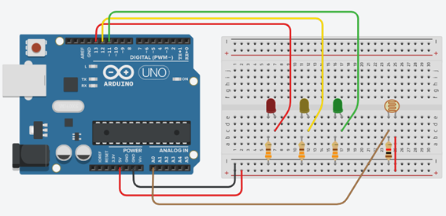
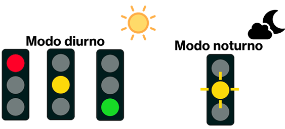
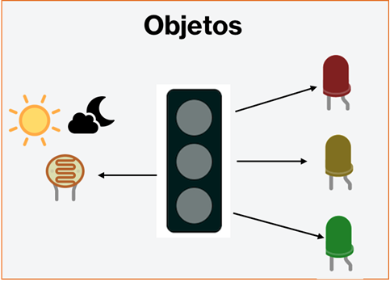
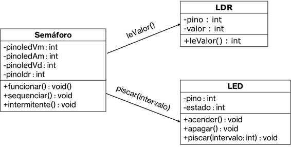
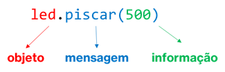

# WORKSHOP PARTE 5
## Sistema orientado a objetos

---
### Objetivos da prática

- Entender o __relacionamento__ e __troca de mensagens__ entre objetos.
- Compreender o uso de objetos em um __sistema organizado por objetos__.

---
### Tarefa 1 - Usando vários objetos

Nesta tarefa vamos utilizar um conjunto de objetos, a fim de criar um sistema __mais organizado__ e utilizando o conceito de __troca de mensages__ entre esses objetos. Até o momento, mesmo utilizando algumas vezes mais de um objeto, ainda não vimos a organização básica de um sistema orientado a objetos.
Vamos criar __um pequeno sistema__ que gerencia um semáforo, que além de suas luzes, possui um sensor de luminosidade para controlar o seu funcionamento durante o dia e a noite.


#### Circuito para a tarefa



##### Lista de componentes para montagem
- 3 LEDs
- 1 LDR
- 3 resistores de 330 ohms
- 1 resistor 1 kohms
- 7 cabos de conexão

Nosso __objeto Semáforo__ será um objeto que irá interagir com um grupo de __3 objetos LEDs__ e __1 objeto LDR__. A construção do nosso semáforo será por meio do objeto objeto Semáforo, que irá instanciar 3 objetos Leds ou apenas 1 objeto LED, dependendo de seu modo de uso. Sempre será utilizado um objeto LDR, para verificar a luminosidade, determinando se é dia ou noite.
No __modo diurno__, o semáforo terá a sequência convencional de um semáforo. Já no __modo noturno__, teremos apenas o LED amarelo piscando, indicando um alerta de proximidade de cruzamento.



#### Objetos envolvidos


#### Classes do Semáforo



Em um __sistema orientado a objetos__ esses objetos __interagem entre si__, através de __troca de mensagens_. Uma troca de mensagem, na prática, indica a __invocação de um método de um objeto por outro objeto__. 
Acima vemos que um objeto Semáforo irá chamar o método __`leValor()`__ da classe __LDR__ e o __`piscar()`__ da classe __LED__, por exemplo. 
Para fazer essa invocação ou chamada, temos que criar um objeto, e através dele utilizar o método e, algumas vezes, enviar também alguma informação (parâmetro para o método), como no método __`piscar()`__. 



___

### Tarefa 2 - Utilizando o sistema de semáforo

Nesta tarefa vamos criar as classes e ver como o objeto Semáforo interage com os demais objetos.

### Representando em código-fonte 

```
class Semaforo{
  int pinoledVm;
  int pinoledAm;
  int pinoledVd;
  int pinoldr;
  
  public:
  Semaforo(int pledVm, int pledAm, int pledVd, int pldr){
    this->pinoledVm = pledVm;
    this->pinoledAm = pledAm;
    this->pinoledVd = pledVd;
    this->pinoldr = pldr;
  }
  
  void sequenciar(){
    Led ledVm = Led(this->pinoledVm);
    Led ledAm = Led(this->pinoledAm);
    Led ledVd = Led(this->pinoledVd);
    ledVm.acender();
    delay(5000);
    ledVm.apagar();
    ledVd.acender();
    delay(5000);
    ledVd.apagar();
    ledAm.acender();
    delay(1000);
    ledAm.apagar();
  }
  
  void intermitente(){
    Led ledAm = Led(this->pinoledAm);
    ledAm.piscar(500);
  }
  
  void funcionar(){
    LDR ldr = LDR(this->pinoldr);
    if(ldr.leValor() > 200){
      this->sequenciar();
    }else{
      this->intermitente();
    }
  }
  
};

```
Vemos que na classe Semáforo encontramos a utilização de objetos __LED__ e __LDR__, e consequentemente o uso de seus métodos.

### Representando em código-fonte (classe LED)

```
class Led{
  int pino;
  int estado;
  
  public:
  Led(int pino){
    this->pino = pino;
    pinMode(this->pino, OUTPUT);
  }
  void acender(){
    digitalWrite(this->pino, HIGH);
  }
  void apagar(){
    digitalWrite(this->pino, LOW);
  }
  void piscar(int intervalo){
    acender();
    delay(intervalo);
    apagar();
    delay(intervalo);
  }
};
```

### Representando em código-fonte (classe LED e LDR)

```
class Led{
  int pino;
  int estado;
  
  public:
  Led(int pino){
    this->pino = pino;
    pinMode(this->pino, OUTPUT);
  }
  void acender(){
    digitalWrite(this->pino, HIGH);
  }
  void apagar(){
    digitalWrite(this->pino, LOW);
  }
  void piscar(int intervalo){
    acender();
    delay(intervalo);
    apagar();
    delay(intervalo);
  }
};

class LDR{
  int valor;
  int pino;
  float lux;
  
  public:
  LDR(int pino){
    this->pino = pino;
  }
  
  int leValor(){
    this->valor = analogRead(this->pino);
    return this->valor;
  }
};

```

Agora vamos utilizar um objeto Semáforo, que irá controlar too o sistema de semáforo, juntamente com os demais objetos. É interessante notar que apenas utilizamos o método _`funcionar()`__ do objeto Semáforo, pois está a lógica que determina o comportamento da sinalização.

### Colocando o Semáforo para funcionar

```
Semaforo semaforo = Semaforo(13, 12, 11, A0);

void setup(){
  Serial.begin(9600);
}

void loop(){
  semaforo.funcionar();
  delay(100);
}

```
---
# Questionário para ser respondido depois do Workshop
 [Link para o questionário](https://docs.google.com/forms/d/1guj-eJKamzxGT-fbIR0lCKtq7HBAaPq17CeLFSADhaY) 
